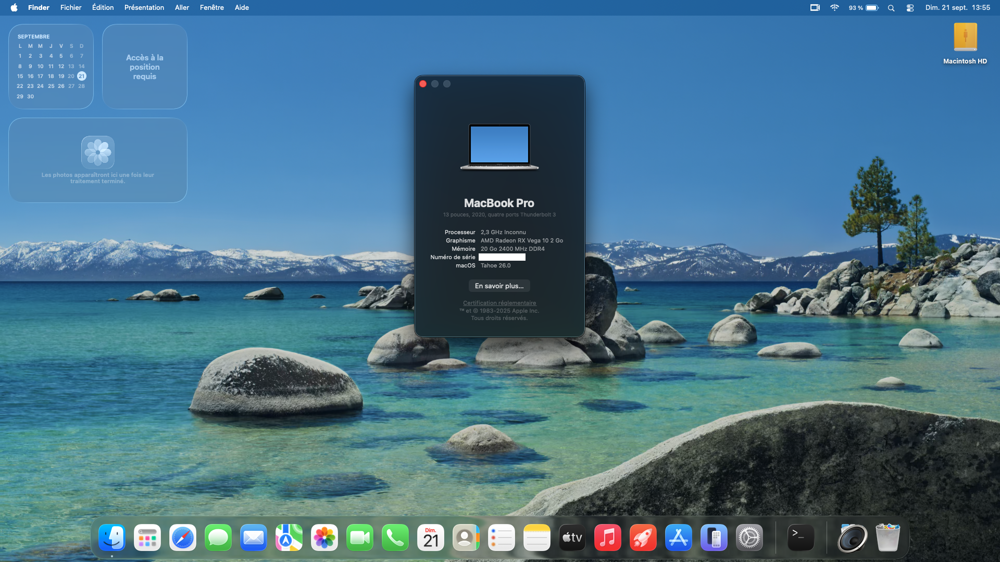

# Asus-vivobook-X712DA_D712DA-hackintosh
EFI for Asus vivobook X712DA_D712DA with amd ryzen 7 3700U with APU

Prebuilt opencore EFI for macos

## Specifications

| Specifications      | Detail                                      |
| ------------------- | ------------------------------------------- |
| Model               | Asus vivobook X712DA_D712DA                 |
| CPU                 | AMD Ryzen 7 3700U                           |
| Memory              | 16GB of ram DDR4                            |
| SSD                 | NVMe Micron_2200V8MTFDHBA256TCK 239GB       |
| Integrated Graphics | AMD Radeon RX Vega 10                      |
| Sound Card          | ALC887                                      |
| Wireless Card       | NOT SUPPORTED                               |
| Ethernet/LAN        | Realtek® GbE LAN USB                       |

# Supported Version of macos
| MacOS version       | Link                                        |
| ------------------- | ------------------------------------------- |
| Tahoe 26            |  [EFI](https://github.com/GeantW0rld/Asus-vivobook-X712DA_D712DA-hackintosh/tree/main/Tahoe)  |

# Configurations
You should use [ProperTree](https://github.com/corpnewt/ProperTree) as PLIST Editor or code-oriented text editor, OC Config. and OCAT : They do not always respect OpenCore's schema, They make changes without informing you, and auto-save these changes when opening your config, baking them in and They have no kext load order logic

- change to `Kernel -> Patch` the number of core (source: [AMD_Vanilla](https://github.com/AMD-OSX/AMD_Vanilla/blob/beta/README.md))

|   macOS Version      | Replace Value | New Value |
|----------------------|---------------|-----------|
| 10.13.x, 10.14.x     | B8000000 0000 | B8 < Core Count > 0000 0000 |
| 10.15.x, 11.x        | BA000000 0000 | BA < Core Count > 0000 0000 |
| 12.x, 13.0 to 13.2.1 | BA000000 0090 | BA < Core Count > 0000 0090 |
| 13.3 +               |  BA000000 00  | BA < Core Count > 0000 00 |

  - The Core Count patch needs to be modified to boot your system. Find the four `algrey - Force cpuid_cores_per_package` patches and alter the `Replace` value only.<br>From the table above substitue `< Core Count >` with the hexadecimal value matching your physical core count. Do not use your CPU's thread count. See the table below for the values matching your CPU core count.


| Core Count | Hexadecimal |
|------------|-------------|
|   4 Core   |     `04`    |
|   6 Core   |     `06`    |
|   8 Core   |     `08`    |
|   12 Core  |     `0C`    |
|   16 Core  |     `10`    |
|   24 Core  |     `18`    |
|   32 Core  |     `20`    |

For example, a user with a 6-core processor should use these `Replace` values: `B8 06 0000 0000` / `BA 06 0000 0000` / `BA 06 0000 0090` / `BA 06 0000 00`


- change SMBIOS with [GenSMBIOS](https://github.com/corpnewt/GenSMBIOS) and [replace it](https://dortania.github.io/OpenCore-Install-Guide/AMD/zen.html#platforminfo) (use MacBookPro16,3 or MacBookPro16,3)

# Bios Settings
| settings            | Option                                      |
| ------------------- | ------------------------------------------- |
| Fastboot            |  Disabled                 |
| Secure Boot            |  Disabled                 |
| IOMMU            |  Disabled                 |
| CSM            |  Disabled                 |
| SATA Mode           |  AHCI                  |
| OS Type          |  Windows 10/UEFI<sup>1</sup>                  |

- <sup>1</sup> some models may require "Other OS" instead

# What's work
- Ethernet
- APU (radeon Vega 10)
- Battery status
- Iservices (IMessage, Icloud, etc..)
- Internal Keyboard
- Trackpad

# What's doesn't work
- Cannot run VM due to the cpu
- Internal display doesn't show anything
- Sounds*

* It doesn't work on MacOS 26 Tahoe due to removal of AppleHDA (can be fixed [here](https://github.com/GeantW0rld/Aorus-B550M-Elite-Hackintosh?tab=readme-ov-file#how-to-fix-audio-on-tahoe))

# How to fix Audio on Tahoe
- download [VoodooHDA](https://github.com/CloverHackyColor/VoodooHDA/releases/tag/Release302) (VoodooHDA.kext-302.zip and VoodooHDA.prefPane.zip)
- extract both zip files
- open terminal and go to where you downloaded the files
- in the terminal type
```bash
sudo xattr -cr VoodooHDA.kext

sudo spctl --master-disable

sudo cp -r VoodooHDA.kext /Library/Extensions/
```
- after allow loading VoodooHDA in the system settings
- finally reboot
- then install VoodooHDA.prefPane
- allow extension then you have sounds :D

# Some screenshots


# Download
Go to release or download the repo zip file

# Credits
[Dortania](https://dortania.github.io/OpenCore-Install-Guide/) - Made the OpenCore guide

[AMD Vanilla](https://github.com/AMD-OSX/AMD_Vanilla) - Patch for AMD CPU

[Acidanthera](https://github.com/acidanthera) - OpenCore Bootloader |  AppleALC | Lilu | VirtualSMC | etc

[ChefKissInc](https://github.com/ChefKissInc/) - for Nootedred

[Apple](https://www.apple.com/) - Made MacOS